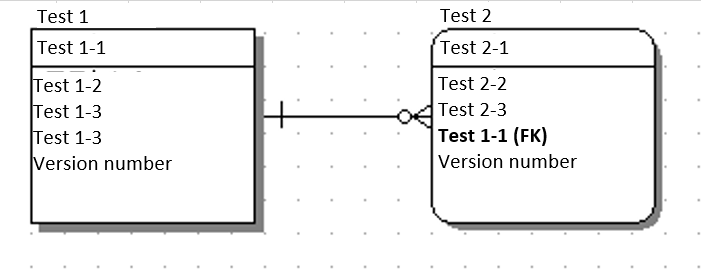
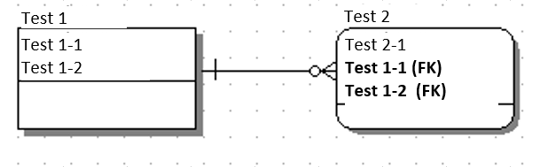

## Annotations that are Used by Entities Generated with generate-entity

This section describes the annotations used by the entities generated with generate-entity.

### Annotations of table
It is assigned to the class

|Annotation | Description|
|:--:|:--|
|@Generated | Indicates that it was automatically generated. | 
|@Entity | Represents an entity. | 
|@Table | Represents the primary table. The attributes are as follows.   name: Table name  catalog: Catalog name  schema: Schema name  uniqueConstraints: Composite unique key constraint| 

### Annotations of column
It is assigned to the getter method of the property corresponding to each column (or the property if the useAccessor parameter is false).

|Annotation | Description|
|:--:|:--|
|@Id | Represents the primary key. |
|@GeneratedValue | Indicates that it will be auto-numbered by the DB.  The attributes are as follows  ・generator: Generator used.   ・Strategy: How to generate a primary key value|
| @SequenceGenerator| Represents the sequence generator configuration that creates the primary key.   It must be simultaneously used with @GeneratedValue.  The attributes are as follows  ・name: A name to identify this generator. Specify in generator of @GeneratedValue.   ・sequenceName: Name of the database sequence object to be used  ・initialValue: Initial value of the primary key  ・allocationSize: Range of values to be cached during assignment|
|@Lob | Represents a persistent field or persistent property of a large object type. |
|@Temporal | Represents the persistent property or persistent field with the type (java.util.Date and java.util.Calendar) that indicates time. |
|@Version | Represents the version field or version property used to use the optimistic lock function.   If the column name is a regular expression version "VERSION([_]?NO)?" and data type of the Entity property are Java.lang.Integer and Java.lang.Long.   The pattern of the column name can be changed with the generation-entity parameter versionColumnNamePattern. |
|@Column | Represents the mapping between a persistent column or persistent property and a column on the database.  The attributes used are as follows.   ・name: Column name  ・columnDefinition: Constraints to be added to the column   ・length: Column length  ・precision: Accuracy of the column   ・scale: Scale of the column  ・nullable:Whether a null value can be specified  ・unique:Whether it is a unique key|

### Annotations of relationship
It is assigned to the getter method of the property corresponding to the table to be joined (or the property if the useAccessor parameter is false).

|Annotation | Description | ER Diagram|
|:--:|:--|:--|
|@ManyToOne | Indicates joining of "many-to-one". |Test 2 is covered |
|@OneToMany | Indicates joining of "one-to-many". |Test 1 is covered |
|@JoinColumn| Represents the foreign key used to join the table.  The attributes used are as follows  ・name: The foreign key column name used to join the target table  ・referencedColumnName: The column name of the joined table referenced by the foreign key column | Test 2 is covered |
|@JoinColumns | Indicates that it is joined using a composite primary key. Has more than one @JoinColumn as an element. |Test 2 is covered |

### About annotations set to primary key properties

This section explains the specification of the annotation set to the primary key property when using the default template file([gsp_entity.ftl](../../src/main/resources/org/seasar/extension/jdbc/gen/internal/generator/tempaltes/java/gsp_entity.ftl)).

First, `@Id` is always set if it is a primary key.

Second, `@GeneratedValue(strategy = GenerationType.IDENTITY)` is set if the column values are auto-increment by the database.
However, in the case of Oracle, since it is not possible to determine whether the column is auto-increment, this annotation will not be set even if the column is auto-increment.
`isAutoIncrement` of `ResultSetMetaData` is used internally to determine whether the column is automatically numbered.
However, in Oracle's JDBC implementation, this method always returns `false`, so it cannot be determined.

For columns that are not aut-increment, annotations are set as follows depending on the value returned by the `getGenerationType` method of `Dialect`.

- When returning `GenerationType.SEQUENCE`
    - The following two annotations are set
        - `@GeneratedValue(generator = "{sequenceName}", strategy = GenerationType.AUTO)`
        - `@SequenceGenerator(name = "{sequenceName}", sequenceName = "{sequenceName}", initialValue = 1, allocationSize = {allocationSize})`
    - `{sequenceName}` is set to `SchemaName.ColumnName_SEQ` (example: `PUBLIC.ID_SEQ`)
    - `{allocationSize}` is set to `allocationSize` specified in [Available parameters](../README.md#available-parameters-3) (default is 1)
- When returning `GenerationType.IDENTITY`
    - `@GeneratedValue(strategy = GenerationType.IDENTITY)` is set
- Otherwise
    - No additional annotations set

By default, the `getGenerationType` of `Dialect` returns `null`.
However, the `getGenerationType` of `OracleDialect` returns `GenerationType.SEQUENCE`.

If you want to return a `GenerationType` other than these, create a custom `Dialect` to replace it.
For how to replace `Dialect`, please refer to [Example of Dialect Class Customization](custom-Dialect.md).
