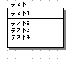
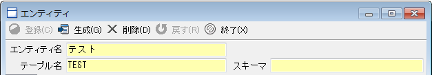
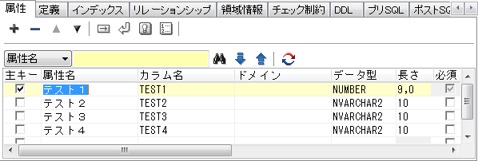
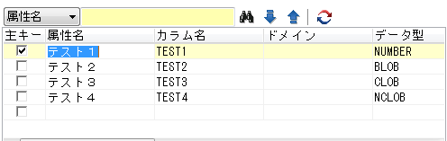
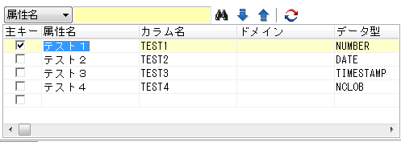
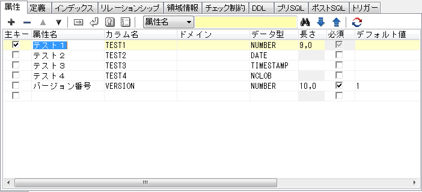
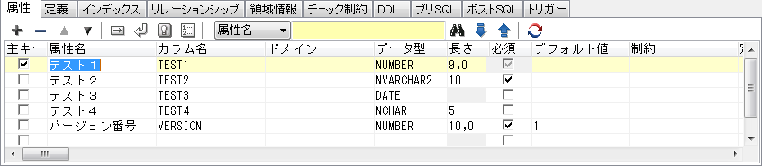

## generate-entityで生成されるエンティティで使用されるアノテーション

generate-entity時に生成されるエンティティに付与されるアノテーションに関して解説します。

クラスに付与されるアノテーション

|Java|説明|ER図|
|:-:|:-|:-:|
|@Generated  | 自動生成されたことを表す。 |無し     |
|@Entity|エンティティであることを表す。 | |
|@Table|主テーブルを指定する。以下の属性が指定される  ・name:テーブル名 ・catalog:カタログ名 ・schema:スキーマ名 ・uniqueConstraints:ユニークキー制約を指定する。| |

アクセサ(使用しない場合はプロパティ)に付与されるアノテーション

|Java|説明|ER図|
|:--:|:--|:--|
|@Id | 主キー|主キーとして設定する |
|@GeneratedValue|主キーにユニークな値を自動で生成，付与する方法を表す。|<!--これが付与される条件は以下の通り ・単独主キーかつ外部キーではない ・数値型を持つ ・カラム名が_idで終わる -->DBによって自動採番される主キーに付与される。|
| @SequenceGenerator|主キーを作成するシーケンスジェネレータの設定を表す。|シーケンスを使用して主キーを自動生成する際に付与される。|
|@TableGenerator|主キーを作成するジェネレータの設定を表す。|テーブルを使用して主キーを自動生成する際に付与される。|
|@Lob|largeオブジェクト型の永続化フィールドまたは永続化プロパティであることを表す。|LOB型のカラム |
|@Temporal|時刻を表す型（java.util.Dateおよびjava.util.Calendar）を持つ永続化プロパティまたは永続化フィールドを表す。|DATE型やTIMESTAMP型のカラム |
|@Transient|永続化対象外とするプロパティやフィールドを表す。|なし。|
|@Version|楽観的ロック機能を使用するために用いるversionフィールドまたはversionプロパティを表す。|カラム名"VERSION"で数値型のカラム |
|@Column|永続化フィールドまたは永続化プロパティと，データベース上のカラムとのマッピングを表す。 使用される属性は以下の通り。 ・name:カラム名 ・columnDefinition:カラムに付加される制約 ・length:カラムの長さ ・precision:カラムの精度 ・scale:カラムのスケール ・nullable:null値を指定できるかどうか ・unique:ユニークキーであるかどうか||
|@ManyToOne|「多対1」で結合することを表す。|テスト2が対象 |
|@OneToMany|「1対多」で結合することを表す。|テスト1が対象 |
|@JoinColumn|テーブルを結合する際に使用する外部キーを表す。 使用される属性は以下の通り ・name:対象テーブルを結合するために使用する外部キーカラム名 ・referencedColumnName:外部キーカラムによって参照された結合先テーブルのカラム名||
|@JoinColumns|複合主キーに対して結合していることを表す。||