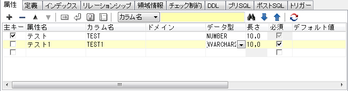

## generate-entityで生成されるエンティティで使用されるアノテーション

generate-entity時に生成されるエンティティで使用されるアノテーションに関して解説します。

### クラスに付与されるアノテーション

|アノテーション|説明|ER図|
|:--:|:--|:--|
|@Generated  | 自動生成されたことを表します。 |なし。     |
|@Entity|エンティティであることを表します。 | |
|@Table|主テーブルを表します。属性は以下の通り。  ・name:テーブル名 ・catalog:カタログ名 ・schema:スキーマ名 ・uniqueConstraints:複合ユニークキー制約| |

### getter(使用しない場合はプロパティ)に付与されるアノテーション

|アノテーション|説明|ER図|
|:--:|:--|:--|
|@Id | 主キーであることを表します。| |
|@GeneratedValue|DBによって自動採番されることを表します。 属性は以下の通り ・generator:@SequenceGeneratorや@TableGeneratorのname属性に設定する値 ・strategy:主キーの値を生成する方法|DB毎に自動採番となる条件は異なります。 例:Oracleの場合 ・単独主キーかつ外部キーではない ・2桁以上のNUMBER型を持つ |
| @SequenceGenerator|主キーを作成するシーケンスジェネレータの設定を表します。 属性は以下の通り ・name:@GeneratedValueのgenerator属性で指定された名前 ・sequenceName:使用するデータベースシーケンスオブジェクトの名前 ・initialValue:主キーの値の初期値 ・allocationSize:割り当てる際にキャッシュしておく値の範囲|@GeneratedValueが付与された中で、シーケンスを使用して自動生成する際に付与されます|
|@TableGenerator|主キーを作成するジェネレータの設定を表します。 属性は以下の通り ・name:@GeneratedValueのgenerator属性で指定された名前 ・initialValue:主キーの値の初期値 ・allocationSize:割り当てる際にキャッシュしておく値の範囲|@GeneratedValueが付与された中で、テーブルを使用して自動生成する際に付与されます。|
|@Lob|largeオブジェクト型の永続化フィールドまたは永続化プロパティであることを表します。| |
|@Temporal|時刻を表します型（java.util.Dateおよびjava.util.Calendar）を持つ永続化プロパティまたは永続化フィールドを表します。| |
|@Transient|永続化対象外とするプロパティやフィールドを表します。|なし。|
|@Version|楽観的ロック機能を使用するために用いるversionフィールドまたはversionプロパティを表します。|カラム名"VERSION"で数値型のカラム |
|@Column|永続化フィールドまたは永続化プロパティと，データベース上のカラムとのマッピングを表します。 使用される属性は以下の通り。 ・name:カラム名 ・columnDefinition:カラムに付加される制約 ・length:カラムの長さ ・precision:カラムの精度 ・scale:カラムのスケール ・nullable:null値を指定できるかどうか ・unique:ユニークキーであるかどうか||
|@ManyToOne|「多対1」で結合することを表します。|テスト2が対象 |
|@OneToMany|「1対多」で結合することを表します。|テスト1が対象 |
|@JoinColumn|テーブルを結合する際に使用する外部キーを表します。 使用される属性は以下の通り ・name:対象テーブルを結合するために使用する外部キーカラム名 ・referencedColumnName:外部キーカラムによって参照された結合先テーブルのカラム名||
|@JoinColumns|複合主キーを使用して結合されることを表します。@JoinColumnを要素として複数持つ。||