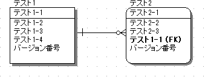
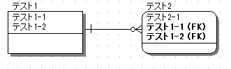

## generate-entityで生成されるエンティティで使用されるアノテーション

generate-entity時に生成されるエンティティで使用されるアノテーションに関して解説します。

### テーブルに関するアノテーション
クラスに対して付与されます

|アノテーション|説明|
|:--:|:--|
|@Generated  | 自動生成されたことを表します。 | 
|@Entity|エンティティであることを表します。 | 
|@Table|主テーブルを表します。属性は以下の通り。  ・name:テーブル名 ・catalog:カタログ名 ・schema:スキーマ名 ・uniqueConstraints:複合ユニークキー制約| 

### カラムに関するアノテーション
各カラムに対応するプロパティのgetterメソッド(パラメータのuseAccessorがfalseの場合はプロパティ自体)に付与されます。

|アノテーション|説明|
|:--:|:--|
|@Id | 主キーであることを表します。|
|@GeneratedValue|DBによって自動採番されることを表します。 属性は以下の通り ・generator:使用するジェネレータ。 ・strategy:主キーの値を生成する方法|
| @SequenceGenerator|主キーを作成するシーケンスジェネレータの設定を表します。 @GeneratedValueと同時に使用する必要があります。 属性は以下の通り ・name:このジェネレータを識別するための名前。@GeneratedValueのgeneratorに指定する。 ・sequenceName:使用するデータベースシーケンスオブジェクトの名前 ・initialValue:主キーの値の初期値 ・allocationSize:割り当てる際にキャッシュしておく値の範囲|
|@Lob|largeオブジェクト型の永続化フィールドまたは永続化プロパティであることを表します。|
|@Temporal|時刻を表します型（java.util.Dateおよびjava.util.Calendar）を持つ永続化プロパティまたは永続化フィールドを表します。|
|@Version|楽観的ロック機能を使用するために用いるversionフィールドまたはversionプロパティを表します。 カラム名が正規表現で「VERSION([_]?NO)?」にマッチし、かつEntityのプロパティのデータ型がjava.lang.Integerおよびjava.lang.Longの場合に付与されます。 カラム名のパターンはgenerate-entityのパラメータversionColumnNamePatternで変更可能です。|
|@Column|永続化フィールドまたは永続化プロパティと，データベース上のカラムとのマッピングを表します。 使用される属性は以下の通り。 ・name:カラム名 ・columnDefinition:カラムに付加される制約 ・length:カラムの長さ ・precision:カラムの精度 ・scale:カラムのスケール ・nullable:null値を指定できるかどうか ・unique:ユニークキーであるかどうか|

### リレーションシップに関するアノテーション
結合するテーブルに対応するプロパティのgetterメソッド(パラメータのuseAccessorがfalseの場合はプロパティ自体)に付与されます。

|アノテーション|説明|ER図|
|:--:|:--|:--|
|@ManyToOne|「多対1」で結合することを表します。|テスト2が対象 |
|@OneToMany|「1対多」で結合することを表します。|テスト1が対象 |
|@JoinColumn|テーブルを結合する際に使用する外部キーを表します。 使用される属性は以下の通り ・name:対象テーブルを結合するために使用する外部キーカラム名 ・referencedColumnName:外部キーカラムによって参照された結合先テーブルのカラム名|テスト2が対象 |
|@JoinColumns|複合主キーを使用して結合されることを表します。@JoinColumnを要素として複数持ちます。|テスト2が対象 |
